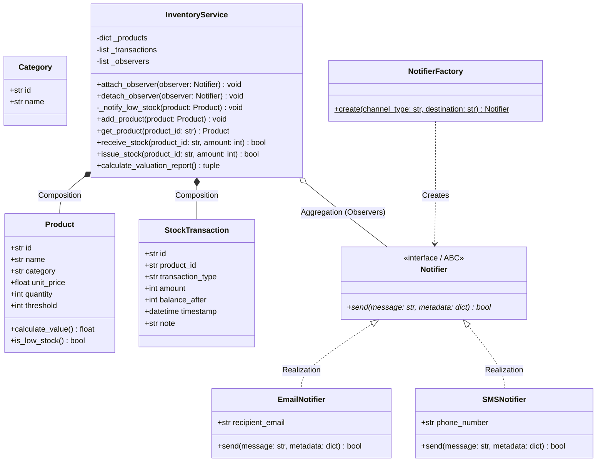

# Class Diagram (Mermaid)

```mermaid
classDiagram
    class Product {
        +str id
        +str name
        +str category
        +float unit_price
        +int quantity
        +int threshold
        +calculate_value() float
        +is_low_stock() bool
    }

    class Category {
        +str id
        +str name
    }

    class StockTransaction {
        +str id
        +str product_id
        +str transaction_type
        +int amount
        +int balance_after
        +datetime timestamp
        +str note
    }

    class Notifier {
        <<interface / ABC>>
        +send(message: str, metadata: dict) bool*
    }

    class EmailNotifier {
        +str recipient_email
        +send(message: str, metadata: dict) bool
    }

    class SMSNotifier {
        +str phone_number
        +send(message: str, metadata: dict) bool
    }

    class NotifierFactory {
        +create(channel_type: str, destination: str)$ Notifier
    }

    class InventoryService {
        -dict _products
        -list _transactions
        -list _observers
        +attach_observer(observer: Notifier) void
        +detach_observer(observer: Notifier) void
        -_notify_low_stock(product: Product) void
        +add_product(product: Product) void
        +get_product(product_id: str) Product
        +receive_stock(product_id: str, amount: int) bool
        +issue_stock(product_id: str, amount: int) bool
        +calculate_valuation_report() tuple
    }

    Notifier <|.. EmailNotifier : Realization
    Notifier <|.. SMSNotifier : Realization
    InventoryService o-- Notifier : Aggregation (Observers)
    InventoryService *-- Product : Composition
    InventoryService *-- StockTransaction : Composition
    NotifierFactory ..> Notifier : Creates
```
