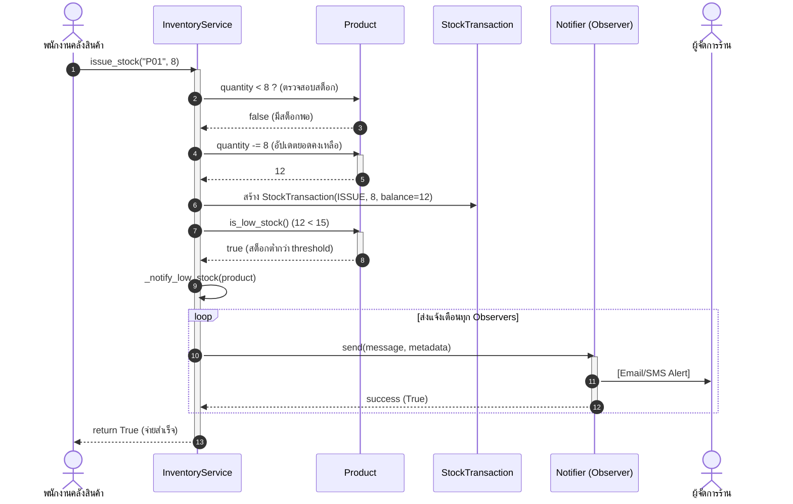

# Sequence Diagram (Mermaid)

แสดงขั้นตอนการทำงานเมื่อพนักงานจ่ายสินค้าจนสต็อกต่ำกว่า Threshold (`issue_stock`)

```mermaid
sequenceDiagram
    autonumber
    actor Staff as พนักงานคลังสินค้า
    participant Service as InventoryService
    participant Prod as Product
    participant Tx as StockTransaction
    participant Obs as Notifier (Observer)
    actor Manager as ผู้จัดการร้าน

    Staff->>Service: issue_stock("P01", 8)
    activate Service

    Service->>Prod: quantity < 8 ? (ตรวจสอบสต็อก)
    Prod-->>Service: false (มีสต็อกพอ)

    Service->>Prod: quantity -= 8 (อัปเดตยอดคงเหลือ)
    activate Prod
    Prod-->>Service: 12
    deactivate Prod

    Service->>Tx: สร้าง StockTransaction(ISSUE, 8, balance=12)

    Service->>Prod: is_low_stock() (12 < 15)
    activate Prod
    Prod-->>Service: true (สต็อกต่ำกว่า threshold)
    deactivate Prod

    Service->>Service: _notify_low_stock(product)
    
    loop ส่งแจ้งเตือนทุก Observers
        Service->>Obs: send(message, metadata)
        activate Obs
        Obs->>Manager: [Email/SMS Alert]
        Obs-->>Service: success (True)
        deactivate Obs
    end

    Service-->>Staff: return True (จ่ายสำเร็จ)
    deactivate Service
```
